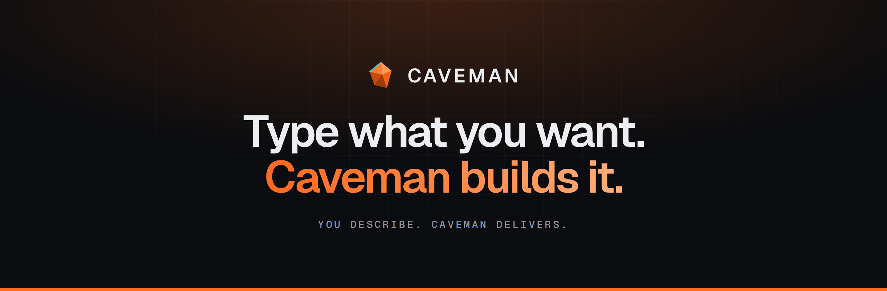
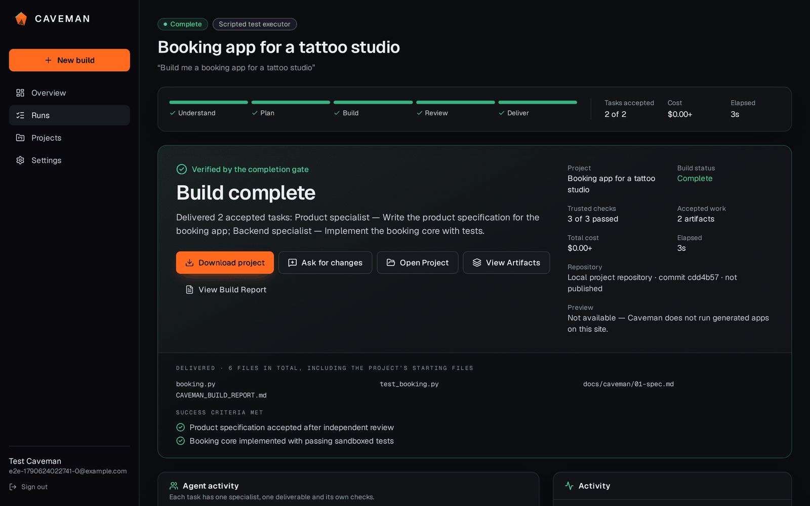
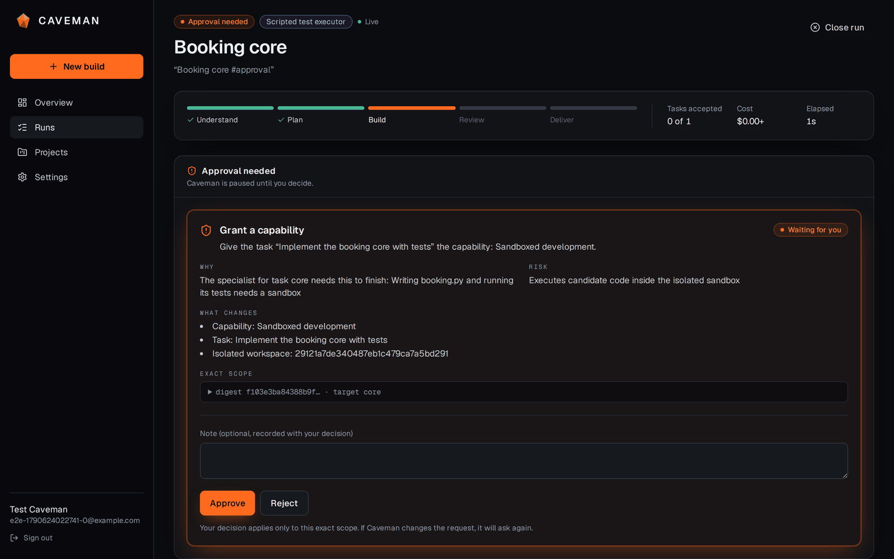

<div align="center">



<br>

[](https://github.com/who-is-michael-mercer/caveman/actions/workflows/ci.yml)
[](LICENSE)
[](pyproject.toml)
[](web/package.json)
[](docs/ROADMAP.md)

**[Quick start](#quick-start)** ·
**[How it works](#how-it-works)** ·
**[Security](#security-model)** ·
**[Docs](#documentation)** ·
**[Roadmap](docs/ROADMAP.md)** ·
**[Contributing](CONTRIBUTING.md)**

</div>

---

Describe a software project in plain English. Caveman breaks the goal into
dependency-aware tasks, assigns specialist agents, runs their work through
trusted checks in an isolated sandbox, has it independently reviewed, retries
or replans when something fails, asks you only about consequential decisions,
and hands back a verified project.

You never manage agents. Behind the product is a durable orchestration core in
which **the model proposes and the kernel authorizes**: nothing counts as done
until trusted checks and an independent reviewer say so.

<p align="center">
  
  <br>
  <sub>A finished build: every stage complete, trusted checks passed, verified by the completion gate. (Recorded with the credit-free scripted executor.)</sub>
</p>

## Why Caveman

|  |  |
| --- | --- |
| **Trusted validation** | Checks run in a Bubblewrap sandbox with no network and no access to your secrets. An agent's claim that tests pass counts for nothing. |
| **Independent review** | A fresh reviewer that never touched the work inspects every candidate before the kernel can accept it. |
| **Durable runs** | Every task, attempt, check and decision is recorded. Close the browser: the build keeps going and survives worker restarts. |
| **You approve what matters** | Consequential actions wait for your decision, bound to the exact scope you were shown. A changed request is shown again. |
| **Spending under control** | Every run has a USD and model-call ceiling. Provider-reported cost is tracked per call and matches the provider's own counter. |
| **Any model** | Model-agnostic via OpenRouter: any tool-calling model, no single vendor required. |

### Proven on real models

The [first live-model campaign](docs/live-campaign/README.md) sent 10 real
requests (6 Python, 3 TypeScript, 1 spec-plus-code) through
`deepseek/deepseek-v4-pro`:

| Builds completed | Total cost | Median cost per build | Median time per build |
| :---: | :---: | :---: | :---: |
| **10 / 10** | **$0.87** | **$0.09** | **5.5 min** |

Two builds hit a bad model output and recovered through a kernel-routed
revision. Every accepted change passed sandboxed checks and an independent
review. (The generated code has not been reviewed by a person.)

## How it works

```text
  You ─── "Build me a booking app for a tattoo studio"
   │
   ▼
 Understand ─▶ Plan ─▶ Build ─▶ Review ─▶ Deliver
               │        │         │          │
               │        │         │          └─ integrated head + build report, verified against kernel records
               │        │         └─ independent reviewer + trusted sandbox checks gate acceptance
               │        └─ one specialist per task, isolated workspace, built on accepted upstream work
               └─ dependency-aware tasks with declared checks and acceptance criteria
```

<p align="center">
  
  <br>
  <sub>Exact-scope approvals: Caveman pauses, explains why and what changes, and binds your decision to that scope digest.</sub>
</p>

### Architecture

```text
Browser
   ↓
Caveman Web            web/            Next.js · auth (Better Auth) · same-origin proxy
   ↓  service token + verified user id
Caveman API            src/caveman/    FastAPI · ownership · approvals · SSE · delivery
   ↓  reads kernel state; queues durable jobs
Orchestration Core     src/walter/     runs · tasks · gates · approvals · recovery · events
   ↓  executed by
Workers / Sandboxes    caveman worker  leased jobs · planner + specialists · Bubblewrap
   ↓
Generated Project      per-project git repo → verified delivery archive
```

- **Core (`src/walter/`)** is authoritative for runs, plans, tasks, dependencies,
  artifacts, validation, review, acceptance, approvals, recovery, replanning and
  completion. See [docs/ENGINE.md](docs/ENGINE.md) for how it works.
- **API (`src/caveman/`)** never duplicates that state. It records who owns which
  project and run, queues execution as leased jobs, projects kernel state into
  honest user-facing views, and binds approval decisions to the exact scope
  digest the user was shown. It has no endpoint that can record a check, a
  review, an acceptance or a completion.
- **Worker** claims jobs and runs them outside any HTTP request, heartbeats,
  and recovers orphaned jobs through the core's own interruption recovery. By
  default it runs the **workflow driver** (`src/caveman/workflow.py`): plain code
  drives plan → delegate → validate → review → accept/integrate → recover, and
  models are used only to plan, do the work and review, so no model calls are
  spent on bookkeeping. Every step still goes through the kernel.
  `CAVEMAN_ORCHESTRATION=manager` restores the original mode, in which the
  Manager model drives each step through tool calls.
- **Web (`web/`)** renders real state over server-sent events. The browser only
  observes and decides; closing it never affects a run.

> **Naming.** Caveman was previously called Walter. The orchestration core keeps
> its internal package name (`src/walter/`) and the `walter` operator CLI for
> compatibility. Everything a user sees is Caveman.

## Quick start

**Requirements:** Linux, Python 3.11+, Node 22+, `git`, and the isolation
backend (`bubblewrap`, `libseccomp2`, `util-linux` for `prlimit`) with
unprivileged user namespaces allowed. On Ubuntu 24.04:

```bash
sudo apt install bubblewrap libseccomp2 util-linux python3-venv
sudo sysctl -w kernel.apparmor_restrict_unprivileged_userns=0
```

**1. Clone and install**

```bash
git clone https://github.com/who-is-michael-mercer/caveman.git
cd caveman
python3 -m venv .venv
.venv/bin/python -m pip install -e '.[test]'
(cd web && npm ci)
```

Use the distribution `python3` (not a toolcache build): the sandbox binds `/usr`
into an environment-cleared namespace, so the interpreter must live under `/usr`.

**2. Configure**

```bash
cp .env.example .env                 # API + worker
cp web/.env.example web/.env.local   # web app
```

Set the same random `CAVEMAN_API_TOKEN` (`openssl rand -hex 32`) in both files,
a `BETTER_AUTH_SECRET` in `web/.env.local`, and either an `OPENROUTER_API_KEY`
(real models) or `CAVEMAN_EXECUTOR=scripted` (credit-free scripted models; see
[Testing](#testing)). Every variable is described in the example files.

**3. Run it** (three terminals)

```bash
.venv/bin/caveman api --port 8000    # private API; binds to localhost
.venv/bin/caveman worker             # executes builds; refuses to start without working isolation
cd web && npm run dev                # or: npm run build && npm start
```

Open http://localhost:3000, create an account, and describe what to build.
Run more workers for more parallel builds; jobs are leased, so they never collide.

## Testing

```bash
.venv/bin/python -m pytest -q                         # backend: core + API + worker (offline)
.venv/bin/python evals/runner.py                      # orchestration scenarios (offline)
cd web
npm run typecheck && npm run lint && npm test         # frontend checks, unit + component tests
npm run build                                         # production build
npx playwright test                                   # end-to-end journeys (starts API, worker, web)
```

The E2E suite starts the real API, a real worker and the production web build.
The worker uses the **scripted test executor** (`CAVEMAN_EXECUTOR=scripted`):
the *model* is scripted, but every state change still goes through the kernel
and every check really runs in the sandbox. Tags in the prompt choose a
scenario: none (plan, build, verify, deliver), `#approval`, `#fail-validation`,
`#dependent` (a code task building on another's merged code) and `#parallel`
(a stale-base rebuild with carry-over). Scripted runs are labelled in the UI,
and the executor is refused when `CAVEMAN_ENV=production`. The browser used by
Playwright must match the pinned `@playwright/test` version
(`npx playwright install chromium`).

`WALTER_LIVE_SMOKE=1 .venv/bin/python -m pytest -q -m live` runs the opt-in,
credit-spending provider smoke test, and
[`scripts/live_campaign.py`](scripts/live_campaign.py) runs a capped batch of
real builds (`--executor scripted` is a free dry run).

[CI](.github/workflows/ci.yml) runs all of the above on every push and pull
request, plus a PostgreSQL pass of the API suite, a secret scan against an
audited baseline, and dependency audits.

## What the product does today

<details>
<summary><b>Accounts, requests and runs</b></summary>

- Accounts with email and password (plus optional GitHub sign-in), password
  reset by emailed link, optional required email verification, signed-in
  device management and password change.
- Plain-English build requests with optional stack, constraints, deployment
  target and budget; the prompt survives sign-up.
- Durable runs executed by workers, recoverable after worker loss, observable
  live; stop, continue (optionally with an instruction), and close.
- A run dashboard showing only real state: stage, tasks and specialists,
  attempts, dependencies, trusted check results (passed / failed / running /
  not run), independent reviews, artifacts with digests and workspace
  fingerprints, failures with classified recovery, replans, approvals, events,
  per-call model usage, provider-reported cost and budget.
- Exact-scope approvals: approve or reject a specific request; a changed request
  must be shown again.

</details>

<details>
<summary><b>Builds, integration and delivery</b></summary>

- Integrated builds: each accepted code change is fast-forwarded onto the
  project's internal integration branch with exactly its validated bytes, and
  later tasks start from that branch, so dependent work builds and is tested on
  top of accepted work. A task built on an outdated base is rebuilt on the new
  one with its previous attempt carried over.
- Existing code: a new project can start from a public GitHub repository.
  Trusted API code checks GitHub's metadata (public, within the size limit),
  makes a shallow HTTPS-only clone without hooks, submodules or credentials,
  refuses symlinks and submodules, leaves out secret-looking files, and starts
  the project from one local commit of the kept files (no upstream history or
  remote). The planner of every run is shown the project's current files, so
  follow-up runs and imports build on what is there.
- Follow-ups: "Ask for changes" on a completed build starts a new run in the
  same project from its integrated code; the new run's delivery contains the
  earlier work plus the change.
- Delivery: when the kernel completes a run, Caveman archives the integration
  head (verified against the kernel's recorded commits) plus a build report.
- Publish to GitHub (when GitHub sign-in is configured): on explicit request,
  Caveman asks for repository scope at that moment, creates a new repository
  with the exact name and visibility you confirm, and pushes only the verified
  integration commit to `main`. The token is encrypted at rest in the auth
  store, used once per request, and never stored by the API. Nothing existing is
  overwritten, and nothing is deployed.

</details>

<details>
<summary><b>Limits, budgets and your data</b></summary>

- Abuse limits per account, enforced by the API across hosts: builds and
  imports per hour, actions per minute, concurrent builds, projects and disk
  (all configurable, see `.env.example`). Over a rate limit the API answers
  429 with `Retry-After`.
- Budgets on by default: a USD ceiling on provider-reported cost plus a
  model-call ceiling per run and per account per month, with a warning at 80%
  and a safe pause at the limit. OpenRouter calls explicitly request cost
  reporting.
- Your data: download everything Caveman holds for your account as JSON
  (account, sign-in methods without tokens, projects, runs, decisions, checks,
  artifacts and events), or delete the account. Deletion needs your password
  (or a recent sign-in for GitHub-only accounts), is refused while a build is
  running, and removes projects, runs, kernel history, conversation sessions,
  repositories and delivery archives before the sign-in itself.

</details>

## Security model

- Generated code is untrusted. It runs only in Bubblewrap with unshared
  namespaces, no network (seccomp), a cleared environment, resource limits and a
  read-only snapshot; credential-shaped files are excluded and unwritable.
  Missing isolation is a hard failure, never a host fallback.
- npm dependencies are installed in a separate jail that has network access but
  runs with install scripts disabled, a cleared environment and only the
  manifest visible. The result is cached by manifest digest and mounted
  read-only into the network-denied jail where candidate code runs.
- The API is private and authenticates the web server with a shared token; the
  web server verifies the user session and forwards only the user id. Every
  project and run lookup is owner-scoped. State-changing browser requests must
  be same-origin JSON, and every page is served with a nonce-based CSP.
- Provider keys live only with workers; the service token only with web and
  API; the auth secret only with the web app. Host paths and credential-shaped
  strings are redacted from everything shown to users.
- Generated apps are never rendered on the Caveman origin. Live previews are not
  implemented rather than implemented unsafely.

The full analysis is in [docs/THREAT_MODEL.md](docs/THREAT_MODEL.md). To report
a vulnerability, see [SECURITY.md](SECURITY.md).

## Deployment

See [deploy/README.md](deploy/README.md): web on Vercel or any Node host, API and
workers on Linux with a shared volume, managed Postgres for authentication, and
the exact container options Bubblewrap needs (verified, with their trade-offs).
Operators should also read the [runbook](docs/RUNBOOK.md). No deployment is
performed by anything in this repository.

## Current limitations

- Sandboxed execution covers Python (`compile`, `pytest`, `pytest_regression`)
  and Node/TypeScript (`node_test` via Node's test runner, `tsc`). Project build
  scripts and dev servers are not run, and other stacks get reviewed source and
  documents without executable checks.
- Isolation is Bubblewrap on a shared kernel. Execution goes through an
  `ExecutionBackend` interface (`src/walter/sandbox.py`), so a microVM or
  managed-sandbox backend can replace it; for a public multi-tenant service,
  that is recommended before launch.
- OpenRouter is the only configured model provider (any tool-calling model on it,
  e.g. Kimi, DeepSeek, Qwen). Model modes (Budget, Balanced, Maximum Quality)
  are offered only when an operator configures them (`CAVEMAN_MODELS_*`).
- Operational and platform state can live in PostgreSQL (`CAVEMAN_DATABASE_URL`),
  which the whole API suite runs against in CI; without it they are SQLite files.
  Project repositories and delivery archives are still files, so API and
  workers share a volume either way. Manager-mode conversation sessions stay
  in SQLite on that volume (the default workflow mode does not use them).
- GitHub publishing is tested against a local stand-in for GitHub; the
  OAuth scope upgrade and token retrieval path has not been exercised against
  github.com from this environment. Repository import is tested against a local
  upstream and supports public repositories only. No live previews yet.
- Some providers do not report cost for every call; Caveman shows cost as
  incomplete instead of estimating it.

## Repository layout

| Path | Contents |
| --- | --- |
| [`src/walter/`](src/walter/) | Orchestration core: kernel, sandbox, durable store, Agents SDK adapter, operator CLI |
| [`src/caveman/`](src/caveman/) | Product layer: FastAPI API, leased-job worker, workflow driver, delivery |
| [`web/`](web/) | Next.js web app: marketing site, auth, live run dashboard |
| [`doctrine/`](doctrine/) | The specifications the core follows; `SYSTEM_PROMPT.md` is loaded at runtime |
| [`docs/`](docs/) | Engine guide, threat model, runbooks, roadmap, implementation state, campaign reports |
| [`tests/`](tests/), [`evals/`](evals/) | Offline backend suite and orchestration scenarios |
| [`deploy/`](deploy/) | Container images, compose file and deployment guide |
| [`scripts/`](scripts/) | Secret scan and live-campaign harness |

## Documentation

| Document | Contents |
| --- | --- |
| [docs/ENGINE.md](docs/ENGINE.md) | The orchestration core in depth: lifecycle, gates, recovery, sandbox, operator CLI |
| [doctrine/](doctrine/README.md) | Authoritative specifications: operating model, permissions, QA, failure recovery |
| [deploy/README.md](deploy/README.md) | Deployment topology, isolation requirements, durability |
| [docs/RUNBOOK.md](docs/RUNBOOK.md) | Operating a hosted Caveman |
| [docs/THREAT_MODEL.md](docs/THREAT_MODEL.md) | Assets, trust boundaries, threats and mitigations |
| [docs/ROADMAP.md](docs/ROADMAP.md), [CHANGELOG.md](CHANGELOG.md) | Direction and dated decisions |

## Contributing

Bug reports with reproductions are the most useful contribution right now. See
[CONTRIBUTING.md](CONTRIBUTING.md) for setup, the checks to run, and the ground
rules the code enforces. Everyone taking part is expected to follow the
[Code of Conduct](CODE_OF_CONDUCT.md).

## License

[MIT](LICENSE)
